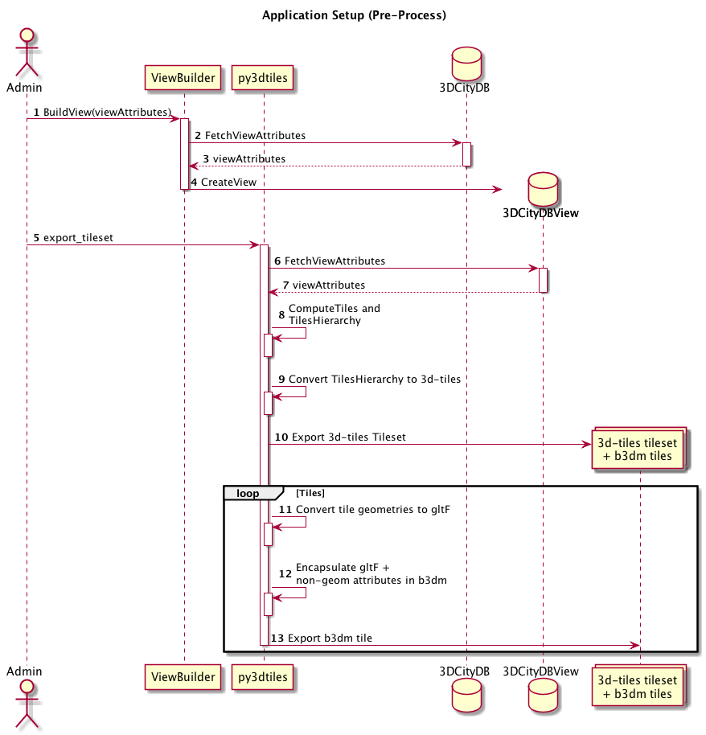

# Architecture

## Quick links for UD-SV [Sofware Architecture](https://en.wikipedia.org/wiki/Software_architecture)
 * A list of [Software Components](https://github.com/VCityTeam/UD-SV/tree/master/SoftwareComponents) and their description/usage

## Examples of architectural diagrams of the project

### UD-SV GUI application structural diagrams

The following diagram depicts, with a loose notation (not UML), the generic structure of an UD-SV GUI application

and here is another tentative (closer, yet not strictly, [an UML component diagram](https://www.uml-diagrams.org/component-diagrams.html)

### Class diagram

Abstract data model of geagraphically attached multimedia assets

### UD-SV sequence diagrams examples

#### Preprocessing of 3d-tiles tileset computations.
**[Puml source](Diagrams/ApplicationSetup.puml)**

On first stage, an admin creates a view on 3DCityDB (e.g. with some scripts). This view will contain each
feature wanted in the dataset, its ids and any attribute related to the features that will be added in the b3dm files.

#### GUI navigation in a 3D representation of a city
**Navigation in a City in 3D diagram:**[Puml source](Diagrams/3DNavigation.puml)

## Architecture related recommended material

### UD-SV level
At the level of the UD-SV project:
 * [Thick client vs Thin Client server strategy](./ThickVsThinClientStrategy.md)
 * [Tools for diagramming](/Tools/ToolForDiagramming.md)
 * [3DCityDB component](3DCityDB.md) architectural elements

### General architecture
 * Introductory material: watch (35') the [C4-Model short presentation](https://c4model.com/)
 * [Software architecture](http://ftacademy.org/sites/ftacademy.org/files/materials/fta-m11-soft_arch-pre.pdf) by Bijlsma, Heerendr, Roubtsova, Stuurman
 * [A Reminder On Three/MultiTier Layer Architecture Design](https://www.hanselman.com/blog/AReminderOnThreeMultiTierLayerArchitectureDesignBroughtToYouByMyLateNightFrustrations.aspx) (by Scott Hanselman): **"If you are designing a layer, know your in's and out's and for Goodness' Sake know your responsibility.  If you don't, back to the drawing board until you do."**
 * [Difference between CRUD and REST](https://softwareengineering.stackexchange.com/questions/120716/difference-between-rest-and-crud): [CRUD](https://en.wikipedia.org/wiki/Create,_read,_update_and_delete) means the basic operations to be done in a data repository. [REST](https://en.wikipedia.org/wiki/Representational_state_transfer) operates on resource  representations (complex objects abstractions), each one identified by an URL. In short: **same thing, different layers** (CRUD falls within the Data Access layer while REST fits in the Business layer).
 * [Stateless vs Stateful](https://en.wikipedia.org/wiki/Stateless_protocol) protocols: there can be **complex interactions between stateful and stateless protocols** among **different protocol layers**. For example, HTTP is an example of a stateless protocol layered on top of TCP, a stateful protocol, which is layered on top of IP, another stateless protocol, which is routed on a network that employs BGP, another stateful protocol. Note: REST**ful** is state**less**.

