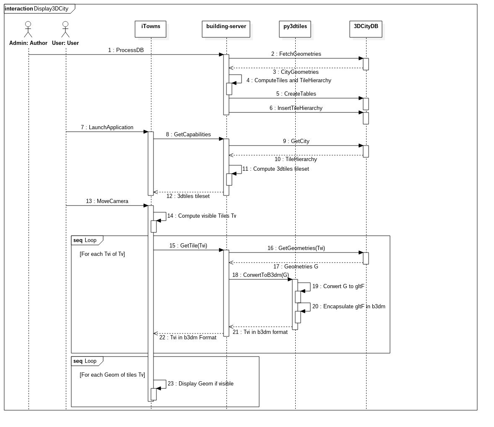

# Architecture of the application

Architecture and related diagrams regarding the whole application.

## Applicative architecture

### Applicative architecture (27/10/2017)

## Software architecture

### Software architecture diagram of Oslandia's developping context with iTowns:

### Software Architecture diagram (17/10/2017)

The following diagram present the current software architecture of our application, its component and associated technologies.

### Global architecture diagram (06/2017):

## Sequence diagrams

### Sequence diagram describing the workflow when displaying a city using our application (without temporality)

The purpose of this sequence is to display a 3D urban area in a web client from a database containing georeferenced and standardized data.

## Discussions

### Thick - Thin Client - server strategy

Our application uses a client / server strategy. We thus have to choose between different strategies: thick client - thin server (the client has a data model and most of the work is done client-side), medium client - medium server (the work is either done client-side or server-side depending on the application), thin client - thick server (most of the work is done server-side). 

As we have different type of applications, data which has a complex structure (3DCityDB database based on CityGML standard) and because we don't want to either overload the client or the server, we choose a medium client - medium server strategy. This means that the work and the data are sometimes located client-side and sometimes located server-side. A rule to determine on which side  the work should be located is:
  * If it is an operation which is done on a regular basis (at every frame for example) or if it is something that influences the visualisation process, it is better to store the data associated client-side and to perform the operations client-side.
  * If it is an operation which is done only in some precise cases (e.g. display semantic data linked to building when picking them), it is better to 
    * client-side: store the minimum of information allowing to retrieve all the information needed for running the operation and to run queries to the server when needed (with the same example, it is better to only send the id of the geometry of the database to the client and to run queries to get the semantic information when a building is picked by the user).
    * server-side: provide means (via an API) to retrieve the needed information from the database when asked by the client.
 
To sum up, view-independent computations are performed on the server-side and reused on the client-side while view-dependant computations are performed on the client-side.
