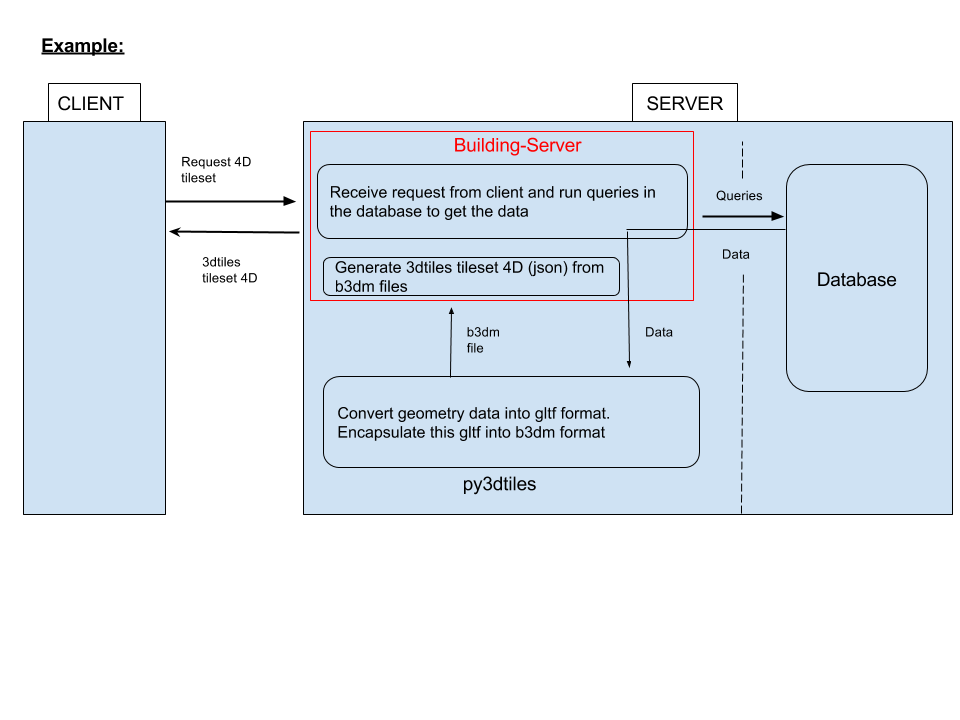
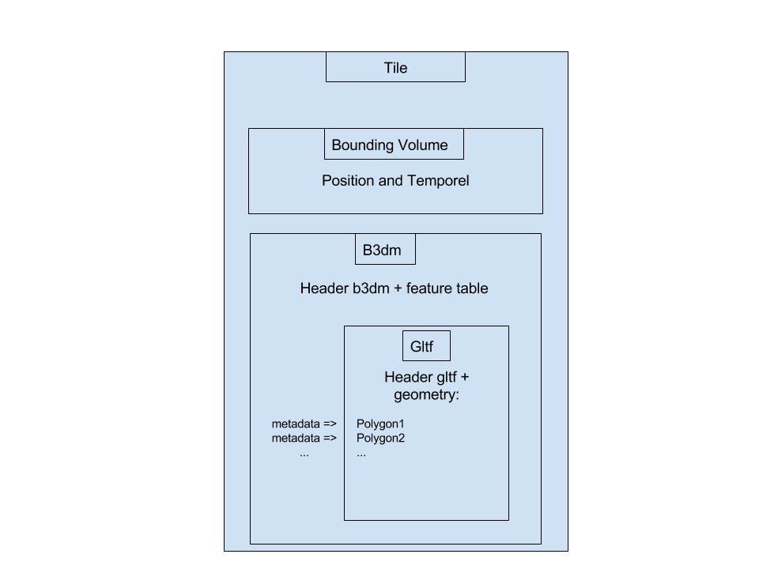
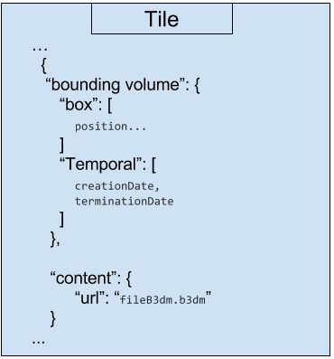

## Design note of [need 17](https://github.com/MEPP-team/RICT/blob/master/Doc/Devel/Needs/Need017.md)

We chose to contribute to 3dtiles standard because it:
 - is a promising emerging standard for streaming 3d urban data over the web  
 - has a strong community a
 - is efficient  
 - is implemented in iTowns (and our solution is based on iTowns framework for now).
 - is also used by Cesium.

The workflow is described [here](https://github.com/MEPP-team/RICT/blob/master/Doc/Devel/Needs/Need021.md#notes). This design note answers parts 3 to 5 of this workflow that goes: 

````
3. the 3Dtiles-server forwards the request to a 3DBCity server
4. the 3DBCity server replies with a collection of a cityobjects 
   to the 3Dtiles-server
5. 3Dtiles-server packages the answer into a b3dm object that it 
   handles over to the iTowns framework
````

Note: The client (iTowns) only knows the hierarchy of the tiles and when it needs to display a region, it gets the geometries of the tiles that are in this region.

Each cityGML object natively has a `creationDate` and a `terminationDate` attribute as shown illustrated on the following diagram (extracted from CityGML 2.0 documentation):


We have one choice (and two solutions) in order to use this temporal information:

1. Solution A: leave this information on the server side

   We leave the temporal information on the server side (the database). When the client wants to display a region at a date d, it requests the server for the tiles 
    - for this region 
    - fort this target date d 
    - and also provides the current display date (0 if not applicable). 
  
   To answer, the server computes the difference expressed in terms of city objects between the current display date and the target date d. For example this difference adds "new" buildings to the city state (i.e. buildings that are not present at current display data) and "removes" buildings from the city state (i.e. buildings that are present at current display date but not present anymore at the target date).
   
   Note: sending such a "city difference" requires the technical ability to specify city objects that are "removed" and thus should not be displayed anymore. In other terms using "city differences" requires a mean to distinguish addition from deletion when sending the city objects. Could this information be located in the metadata that b3dm can add to the Gltf geometries ? 

2. Solution B:
 
   We propose a 4D evolution of 3D-tiles (4D-tiles ?) : 3D-tiles + temporal. With this evolutoin, each tile has then a bounding volume as well as an additional temporal interval of existence (corresponding to `creationDate` and `terminationDate` attributes). This requires to change the way tilesets are constructed in order to add the temporal information. Indeed, if we don't, we might have tiles with objects close to each other in the spatial dimension but existing on very disparate time periods. On the client side, we will choose if a tile is displayed not only based on its 3D bounding volume but also on its temporal existence. If a tile is displayed at a date d but a city object in the tile doesn't exist at this date d, then we will use culling process to not display this city object (kind of a temporal culling by city object).

We choose solution 2.

The workflow is detailed here:



Currently, we know the valid period of each tile. This period begins at the earliest starting date among the city objects in the tile and end at the latest ending date among these. It might be possible that some objects don't exist at a certain date for which a tile is diplayed ( because the date is in the valid period of the tile but not in the valid period of the object).
The problem is that with the method proposed above, we don't know the valid period of a city object on the client side. For that, we propose the following method:
  
Currently, in the gltf file each geometry has an id named: batch_id. In the b3dm header there is metadata associated to each batch_id, we use these metadata to add the temporal information to the geometries.
In the client, we use these temporal information to know if a city object should be displayed or not. This comparison process is done in the shaders.

The explication of tile and b3dm:



### Discussion of the 26/07/2017

What we need to do next:

  * In the database:
     * Fill the database with temporal CityGML examples (refer to the first task of [this issue](https://github.com/MEPP-team/RICT/issues/23))
  * In building-server:
     * Modify the API of building server to retrieve this temporal information from the database
     * Modify the way tiles are created in order to add their temporal interval of existence
  * In py3dtiles:
     * Add the temporal information into the tiles: in the attributes of the b3dm linked to the batch_ids, add a temporal attribute having the corresponding value from the database

Each part is detailed below:
     
#### Fill the database with temporal CityGML examples

We create a dev database for the issues linked to temporality. Then, we insert temporal CityGML files in it (provided by FPE).
In these temporal files sometimes the creationDate and terminatioNDate of CityGML objects are used and sometimes the yearOfConstruction and yearOfDemolition dates are used. What are the differences between these dates and which ones should we use ?

#### Modify the API of building server to retrieve this temporal information from the database

This should be done in [MEPP-team's fork of Oslandia's building-server](https://github.com/MEPP-team/building-server/tree/3dCityDB) on a to be created branch named 3d-tiles-temporal based on 3dCityDB branch. It is needed to change the SQL queries retrieving the city objects of the tiles to also get the temporal information.

#### Modify the way tiles are created in order to add their temporal interval of existence

Each tile is composed of city objects which have a temporal interval of existence. The temporal interval of existence of a tile is starting at the earliest creationDate from its city objects and ending at the latest terminationDate of its city objects. The bounding volume of each tile (currently 3D) should be extended with this temporal interval. This should be done in [MEPP-team's fork of Oslandia's building-server](https://github.com/MEPP-team/building-server/tree/3dCityDB) on a to be created branch named 3d-tiles-temporal based on 3dCityDB branch.

Like this example: 



#### Add the temporal information into the tiles

Changes should be made to [MEPP-team's fork of Oslandia's building-server](https://github.com/MEPP-team/building-server/tree/3dCityDB) on a to be created branch named 3d-tiles-temporal based on 3dCityDB branch and to [MEPP-team's fork of Oslandia's py3dtiles](https://github.com/MEPP-team/py3dtiles) on a to be created branch named 3d-tiles-temporal.

In building-server, the temporal information of each city object must be transferred to py3dtiles. In py3dtiles, the temporal information must be added in the attributes of the b3dm using the batch_id.

