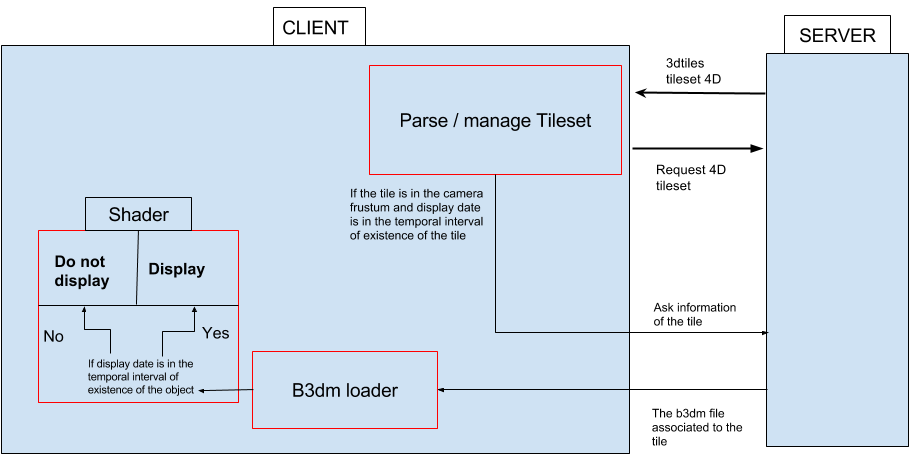

## Design note of [need 21](https://github.com/MEPP-team/RICT/blob/master/Doc/Devel/Needs/Need021.md)

This is the client side design corresponding to [this server side design](https://github.com/MEPP-team/RICT/blob/master/Doc/Devel/Design/DesignNote017.md)

To answer this need, we will contribute to [iTowns](https://github.com/iTowns/itowns) in the branch 3dtiles-temporal.

### The work we have to do in iTowns

#### Modify the reader of tilesets

After [modifying](https://github.com/MEPP-team/RICT/blob/master/Doc/Devel/Design/DesignNote017.md#modify-the-api-of-building-server-to-retrieve-this-temporal-information-from-the-database) the tileset creation server-side to add a temporal interval of existence of each tile, we have to modify the reader of tilesets in iTowns to manage this temporal information. Once we have retrieved this temporal information, we have to modify the culling 
When we do that, we can know if we display the tile inside the bounding, if the tile is in the camera frustum and display date is in the temporal interval of existence of the tile.

#### Recover/ Parse [the b3dm file](https://github.com/AnalyticalGraphicsInc/3d-tiles/tree/master/TileFormats/Batched3DModel)

[The server modify the b3dm file for add the temporal information for each tiles](https://github.com/MEPP-team/RICT/blob/master/Doc/Devel/Design/DesignNote017.md#add-the-temporal-information-into-the-tiles), so we need to parse that in iTowns for recover the temporal interval and add to the structure of iTowns.

#### Modify [the pixel shader](https://en.wikipedia.org/wiki/Shader) 

To explain simply, the pixel shader is used to color each pixel of an object. We use this shader for display or not the object with the temporal information. 
For example if the date choose the user are 1900 and the date of one object are 1800 - 1890 the shader compare this and return don't display this object.
