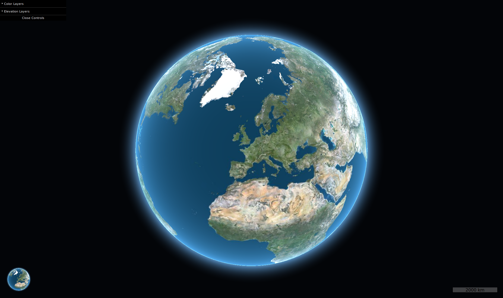
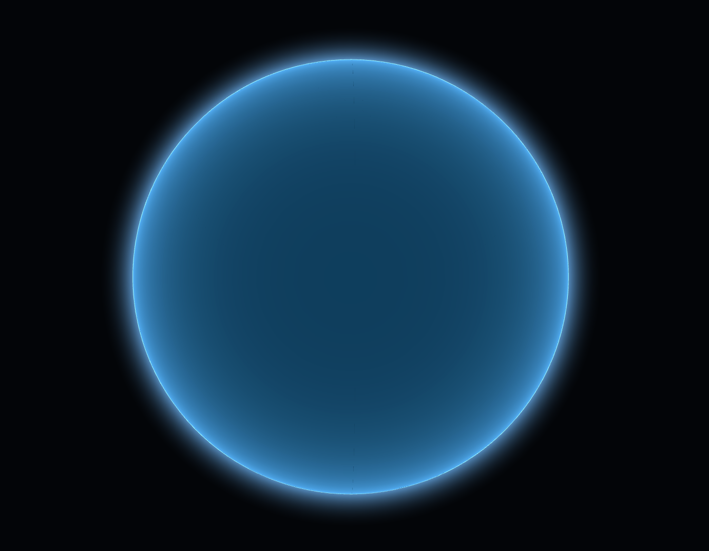
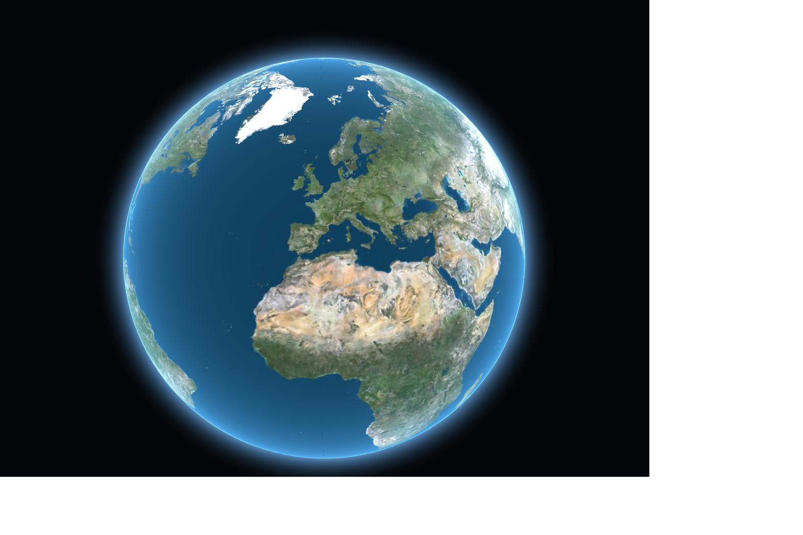
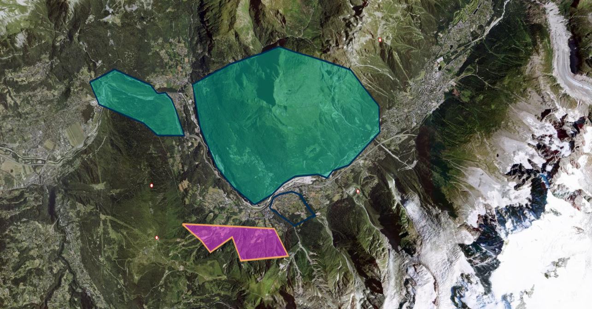
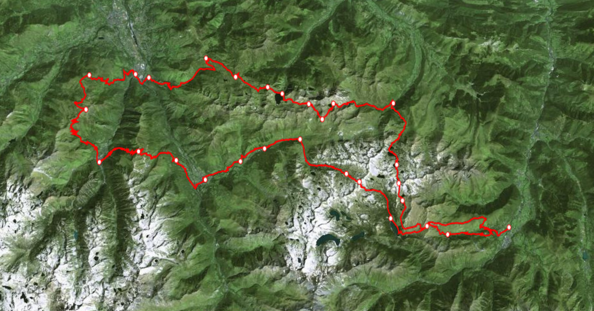
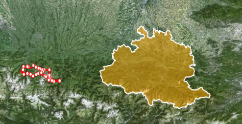
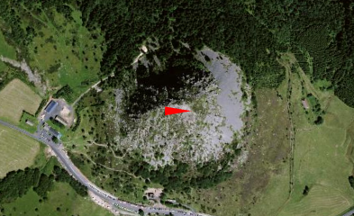
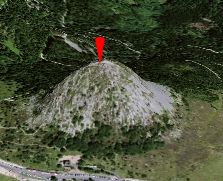
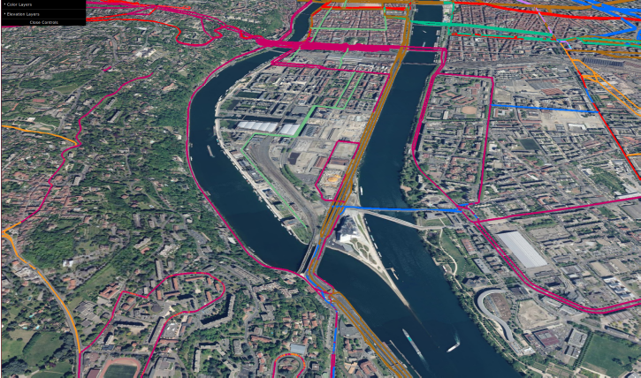
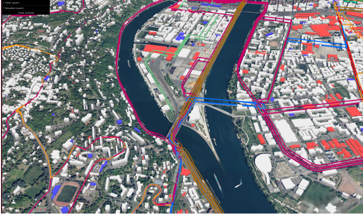

# Tutoriel iTowns

## Introduction

Le but de ce tutoriel est d'apprendre à mettre en place une application utilisant certaines fonctionnalités proposées par iTowns en peu de temps. Ce tutoriel est inspiré [des exemples fournis par iTowns](https://github.com/iTowns/itowns/tree/master/examples).

## Préambule

### iTowns

[iTowns](https://github.com/iTowns/itowns) est un framework de visualisation de données géospatiales 3D sur le web. Des exemples d’utilisation sont disponibles [ici](http://www.itowns-project.org/itowns/examples/index.html). Il est écrit en JavaScript / WebGL et est basé sur la librairie JavaScript de référence pour la 3D: [Three.js](https://threejs.org/). La documentation d'iTowns est disponible [ici](http://www.itowns-project.org/itowns/docs/#home).

iTowns est composé de vues et de layers. Une vue peut être « planaire » ou « globe » :


Les layers sont des couches de données que l’on peut ajouter à la vue. iTowns supporte un certain nombre de format de données et de standards de communication qu’il est possible d’utiliser pour créer des layers : OGC standards (WMTS, WMS, TMS, WFS), Point Clouds, GeoJSON, GPX, KML, 3D formats (Collada, GLTF, OBJ, ...), 3D tiles, DEM.

Dans ce tutoriel, nous allons voir comment instancier une vue globe et y ajouter des couches de données (exemple : données geojson représentant les limites d’un département, maillages 3D, lignes de bus lyonnaises obtenues par flux WFS, etc.)

Les contrôles de caméra dans iTowns sont les suivants :
Click-gauche: Translation de la camera sur le globe (drag)
Click-droit: Translation du globe (pan)
Ctrl + Click-Gauche: Rotation de la camera (orbit)
Molette de la souris : zoom avant / arrière

### Les Web Services 

Afin de récupérer des données à ajouter à notre vue, nous allons parfois communiquer avec des services web. Un service web est une brique logicielle dotée d'une interface permettant l'interaction avec des composants situés sur d'autres machines connectées au web. L'interaction se fait généralement à l'aide d'URLs normalisées (REST, WMS, WFS, etc.).
Dans ce tutoriel, nous allons communiquer avec des services web qui vont nous fournir des cartes ou des informations géographiques (exemple : les bâtiments en 3D de la ville de Lyon). Cette communication se fera via certains des standards de l’Open GeoSpatial Consortium1 (OGC) pour la communication de données géospatiales sur le web (WMS, WFS, KML, etc.).
Dans ce tutoriel nous utiliserons WMTS (Web Map Tile Service) et WFS (Web Feature Service).

__WMTS__ :
 * Fournit une carte sous forme de plusieurs images (tuiles)
 * Les tuiles sont calculées et rendues sur le serveur. Les performances de transfert et d’affichage sont élevées car c’est de la transmission et de l’affichage d’image mais la présentation est prédéfinie et il y a peu de modifications possibles de la carte côté client (dans le navigateur web par exemple).

__WFS__ :
 * Fournit des données géospatiales vers un client web
 * Il appartient au client de décider quoi faire avec les données (exemple : utilisation pour un affichage, utilisation pour une analyse locale avant l'affichage)
 * Permet une plus grande flexibilité que le WMTS car le client peut choisir le style et la façon d'afficher les données
 * Le WFS transactionnel permet à l'utilisateur d'ajouter et de modifier les données sur le serveur

## Installation 

### Vérification du fonctionnement de WebGL

iTowns s’appuie sur le technologie WebGL. Il est donc nécessaire de vérifier que votre navigateur (Chrome, Firefox) le supporte. Pour cela, vous pouvez par exemple essayer ce lien :

http://www.itowns-project.org/itowns/examples/globe.html

Voici le résultat attendu:



Si cet exemple ne fonctionne pas, voici quelques pistes :
 * Mise à jour de votre navigateur
 * Mise à jour de votre carte graphique
 * Si le problème persiste, essayez de voir si le problème est connu sur http://get.webgl.org/

### Installation d'iTowns

Télécharger la dernière version de iTownssur le github: https://github.com/iTowns/itowns 
(choisir le fichier « Source code (zip) »).
Extraire l’archive. Si vous êtes sous Windows, placez le dossier extrait dans le répertoire Système (C:). Nous appellerons ce dossier extrait le répertoire racine d’iTowns.

#### Linux

Ouvrez un terminal et tapez les commandes :

```
    sudo apt-get install nodejs
    sudo apt-get install npm
    sudo npm install -g n
    sudo n latest
```

Ces commandes permettent d’installer nodejs ainsi que la dernière version de npm.

Placez-vous dans le répertoire racine d’iTowns.
Lancez la commande : `npm install`

Exécutez `npm start` et vérifiez que le serveur fonctionne en ouvrant la page http://localhost:8080/examples/globe.html dans votre navigateur (Firefox ou Chrome de préférence).

Vous pouvez stopper le serveur avec la commande `ctrl+c`.

#### Windows

Vérifiez que Windows Powershell 3 est installé.
Si c’est le cas, ouvrez en un et exécutez la commande :

`iex (new-object net.webclient).downloadstring('https://get.scoop.sh')`

Cette commande permet d’installer Scoop qui est un gestionnaire de paquets Windows.
Note : S’il vous est demandé par le terminal d’effectuer une commande pour pouvoir éxecuter la commande précédente, aites le.

Installez nodejs avec la commande suivante : `scoop install nodejs`

Placez-vous dans le répertoire racine d’iTowns.
Lancez la commande : `npm install`

Exécutez `npm start` et vérifiez que le serveur fonctionne en ouvrant la page http://localhost:8080/examples/globe.html dans votre navigateur (Firefox ou Chrome de préférence)

Vous pouvez stopper le serveur avec la commande `ctrl+c`.

#### OSX

Ouvrez un terminal.
Installez le gestionnaire de paquets en ligne de commande Homebrew :

`/usr/bin/ruby -e "$(curl –fsSL https://raw.githubusercontent.com/Homebrew/install/master/install)"`

Installez nodejs ainsi que la dernière version de npm:
`brew install node`

Placez-vous dans le répertoire racine d’iTowns.
Lancez la commande : `npm install`

Exécutez `npm start` et vérifiez que le serveur fonctionne en ouvrant la page http://localhost:8080/examples/globe.html dans votre navigateur (Firefox ou Chrome de préférence).

Vous pouvez stopper le serveur avec la commande `ctrl+c`.

## Création d'une application utilisant iTowns

Créez un dossier dans le répertoire racine d’iTowns que vous pouvez par exemple appeler ‘urbanViewer’. Dans ce dossier, créez un fichier index.html qui correspondra au fichier html source de notre application.

Insérez les lignes suivantes dans le fichier index.html :

```
    <!doctype html>
    <html>
    <head>
        <title>Urban Viewer</title>
        <meta charset="UTF-8">
        <meta name="viewport" content="width=device-width, initial-scale=1.0">
    </head>
    <body>
        <script src="../dist/itowns.js"></script>
    </body>
    </html>
```

_Note : La balise `<script>` permet d’importer du JavaScript dans un document HTML. Elle nous permet ici d’importer iTowns._

Ouvrez le fichier index.html que nous venons de créer avec votre navigateur. Vous devriez voir une page blanche, c’est normal nous n’avons encore rien affiché.

_Note : Si votre serveur local est lancé (npm start), vous pouvez accéder au fichier via l’url http://localhost:8080/urbanViewer/index.html . Nous y accéderons de cette manière dans la suite du Tutoriel. localhost correspond à l’adresse où se trouve votre serveur, c’est-à-dire en local dans notre cas et 8080 correspond au port sur lequel votre serveur est actif. urbanViewer/index.html correspond ensuite au chemin depuis le répertoire où vous avez lancé npm start._

### Affichage d'un globe

Dans cette partie, nous allons ajouter un globe à notre page web en utilisant les fonctionnalités offertes par iTowns.

#### Initialisation du conteneur de scène 3D

Nous allons tout d’abord créer un containeur ‘div’ dans notre page html qui contiendra la partie 3D de notre application.

Pour cela, ajoutez la ligne suivante dans le body:  

`<div id="viewerDiv"></div>`

Nous allons ensuite ajouter du style à notre page html (en utilisant le langage CSS) :

```
    <style type="text/css">
            html {
                height: 100%;
            }

            body {
                margin: 0;
                overflow: hidden;
                height: 100%;
            }

            div {
                margin : auto auto;
                width: 100%;
                padding: 0;
                height: 100%
            }
    </style>
```

Ici nous spécifions que la partie html prendra 100% de la hauteur de la page ; que le body occupera 100% du html et que le div occupera 100% du body.


#### Création du globe

Nous allons maintenant pouvoir commencer à coder en JavaScript pour ajouter un globe à notre scène. La première étape consiste à créer un objet JavaScript globeView qui contiendra les éléments de la vue (globe, layers). Vous pouvez trouver de la documentation sur globeView [ici](http://www.itowns-project.org/itowns/docs/#api/View/GlobeView)

Le constructeur de globeView prend en argument le conteneur <div> dans lequel il doit être placé et les coordonnées du point vers lequel la caméra sera dirigée. Je vous propose de centrer la caméra sur Lyon. Vous pouvez donc créer un globeView avec le code suivant :

```
    //************ Create globeView
    // Define the coordinates on wich the globe will be centered at the initialization
     var viewerDiv = document.getElementById('viewerDiv');
     var position = new itowns.Coordinates('WGS84', 2.35, 48.8, 25e6);
     var view = new itowns.GlobeView(viewerDiv, position);  
```

Vous devriez obtenir un globe non texturé :



#### Ajout d'un layer d'imagerie

Pour ajouter un layer d’imagerie (une carte), nous allons utiliser une couche WMTS fournie par iTowns. 
Le code suivant permet de charger cette couche JSON et de l’ajouter comme layer à notre vue :

```
    //****************** Add Imagery Layer
   var orthoSource = new itowns.WMTSSource({
                url: 'http://wxs.ign.fr/3ht7xcw6f7nciopo16etuqp2/geoportail/wmts',
                name: 'ORTHOIMAGERY.ORTHOPHOTOS',
                tileMatrixSet: 'PM',
                format: 'image/jpeg',
            });

            var orthoLayer = new itowns.ColorLayer('Ortho', {
                source: orthoSource,
            });

            view.addLayer(orthoLayer);
```

A ce stade-là du tutoriel vous devez avoir ce globe :


#### Modification du layer d'imagerie

Il est possible d’accéder à d’autres types de cartes à appliquer sur notre globe. Nous pouvons par exemple ajouter une carte fournie par [basemaps](https://carto.com/location-data-services/basemaps/).
Commentez les lignes permettant d’ajouter le layer précédent et ajoutez ces lignes dans globe.js :

```
    var layer2 = {    update: itowns.updateLayeredMaterialNodeImagery,
        type: 'color',
        protocol: "wmtsc",
        id: "DARK",
        customUrl: "http://a.basemaps.cartocdn.com/light_all/%TILEMATRIX/%COL/%ROW.png",
        networkOptions: { crossOrigin: 'anonymous' },
        options: {
            attribution: {
                "name":"CARTO",
                "url": "https://carto.com/"
            },
            tileMatrixSet: "PM",
            mimetype: "image/png"
        },
    }

    globeView.addLayer(layer2);
```

_Note: Si vous ne comprenez pas tout le paramétrage de ce layer pour le moment ce n’est pas grave, nous reviendrons dessus plus tard dans le tutoriel. L’important est de voir qu’on peut utiliser différents layers d’imageries._

Vous devriez observer un globe de ce type :



Pour la suite du tutoriel, revenez au layer de la partie précédente (partie 2.1.3).

#### Ajout de layers d’élévation

Si vous zoomez sur une chaine de montagne et que vous utilisez ctrl+click gauche pour incliner la vue, vous remarquerez que le terrain est plat. Pour remédier à ça, nous allons ajouter deux layers d’élévations de la même manière que nous avons ajouté le premier layer d’imagerie.

Pour éviter de répéter la fonction permettant d’ajouter un layer au globe (la fonction que nous avions placé dans le then), nous proposons de créer une fonction addLayerToGlobe(layer).

Les deux layers que nous allons ajouter sont décrits dans les fichiers ‘WORLD_DTM.json’ et ‘IGN_MNT_HIGHRES.json’ et sont également fournis par iTowns.

Notre partie du code permettant d’ajouter des layers devient ainsi:

```
    //*********** Add Imagery layer
    function addLayerToGlobe(layer) {
        return globeView.addLayer(layer);
    }

    itowns.Fetcher.json('../examples/layers/JSONLayers/Ortho.json').then(addLayerToGlobe);

    // Add two elevation layers.
    // These will deform iTowns globe geometry to represent terrain elevation.
    itowns.Fetcher.json('../examples/layers/JSONLayers/WORLD_DTM.json').then(addLayerToGlobe);
    itowns.Fetcher.json('../examples/layers/JSONLayers/IGN_MNT_HIGHRES.json').then(addLayerToGlobe);
```

Ces deux layers sont complémentaires : le deuxième permet d’avoir des informations d’élévation plus précises que le premier et est paramétré pour n’être affiché qu’à partir d’un certain niveau de zoom.

Le mieux et de vous en persuader par vous-même en comparant des vues sans aucun des deux layers, avec un des deux layers et avec les deux layers en même temps.

### Ajout de données vecteur

iTowns permet l’ajout de différentes données vecteur comme par exemple des données [kml](https://developers.google.com/kml/documentation/), des données [gpx](http://www.topografix.com/gpx.asp) et des données [geojson](http://geojson.org/).

Modifiez la position initiale de la caméra pour visualiser plus facilement les objets que nous allons ajouter : longitude : 3.5, latitude : 44, altitude : 1000000.

Nous allons commencer par ajouter un layer kml :

```
    //********* Add vector Data
    globeView.addLayer({
        type: 'color',
        url: 'https://raw.githubusercontent.com/iTowns/iTowns2-sample-data/master/croquis.kml',
        protocol: 'rasterizer',
        id: 'Kml',
    });
```

Il est fort probable que vous ne voyez rien apparaitre pour le moment. Explications : JavaScript étant asynchrone, le layer de données kml peut être affiché avant le layer d’imagerie et donc caché par ce dernier. Il est donc nécessaire d’organiser nos layers. Cela est possible grâce à la fonctionnalité suivante d’iTowns :

```
    // Listen for globe full initialisation event
    globeView.addEventListener(itowns.GLOBE_VIEW_EVENTS.GLOBE_INITIALIZED, function () {
        console.info('Globe initialized');
        itowns.ColorLayersOrdering.moveLayerToIndex(globeView, 'Ortho', 0);
    });
```

iTowns contient un certain nombre d’évènements qui sont déclenchés lorsqu’il a complété des actions de fonctionnement. Une partie de ces évènements sont liés à la vue globe : http://www.itowns-project.org/itowns/API_Doc/global.html#GLOBE_VIEW_EVENTS

Nous utilisons ici l’évènement GLOBE_INITIALIZED qui est déclenché lorsque le globe est complètement initialisé. Nous plaçons un « callback » sur cet évènement qui permet de placer le layer Ortho (donc le premier layer d’imagerie ajouté dans notre tutoriel) à la position 0, c’est-à-dire qui en fait la première couche à être affichée.

Il reste cependant un risque ici : il se peut que le globe soit initialisé mais que le layer ne soit pas encore créé, ce qui entrainerait un problème puisque nous le manipulons ici. Nous allons utiliser les [promesses](https://developer.mozilla.org/fr/docs/Web/JavaScript/Reference/Objets_globaux/Promise) pour pallier ce problème :

 * Créez un objet global ‘Promise’ : `var promises = [];`
 * Ajoutez les ajouts de layers déjà créés à cet objet ‘promises’. Exemple :

 ```
    promises.push(itowns.Fetcher.json('../examples/layers/JSONLayers/Ortho.json').then(addLayerToGlobe));
 ```

  * Nous avons maintenant un moyen de vérifier que tous les layers ont été chargés avec la syntaxe :

```
    Promise.all(promises).then(function () {
        // DO SOMETHING HERE
    });
```

Cette syntaxe signifie que la fonction qui se trouve dans le then ne sera effectuée seulement lorsque tous les layers ont été ajoutés à la vue. Nous allons donc placer le classement des layers à cet endroit là. Ce qui nous donne finalement :

```
    // Listen for globe full initialisation event
    globeView.addEventListener(itowns.GLOBE_VIEW_EVENTS.GLOBE_INITIALIZED, function () {
        console.info('Globe initialized');
        Promise.all(promises).then(function () {
            itowns.ColorLayersOrdering.moveLayerToIndex(globeView, 'Ortho', 0);
        });
    });
```

Vous devriez maintenant voir apparaitre le layer kml suivant (dans les alpes) :



Nous allons maintenant ajouter un layer de données gpx (format de fichier permettant l’échange de données GPS). On procède de la même manière que pour le layer de données kml :

```
    promises.push(globeView.addLayer({
        type: 'color',
        url: 'https://raw.githubusercontent.com/iTowns/iTowns2-sample-data/master/ULTRA2009.gpx',
        protocol: 'rasterizer',
        id: 'Gpx',
    }));
```

Vous devriez observer un parcours dans les Pyrénées :



Enfin, nous allons ajouter un layer geojson d’une manière similaire :

```
    promises.push(globeView.addLayer({
        type: 'color',
        url: 'https://raw.githubusercontent.com/gregoiredavid/france-geojson/master/departements/09-ariege/departement-09-ariege.geojson',
        protocol: 'rasterizer',
        id: 'ariege',
        style: {
            fill: 'orange',
            fillOpacity: 0.5,
            stroke: 'white',
        },
    }));
```

Vous devriez voir le département de l’Ariège surligné en orange :



### Ajout d’un menu de gestion des couches (layer)

iTowns offre la possibilité d’ajouter un menu via la librairie [dat.gui](https://workshop.chromeexperiments.com/examples/gui/) que vous allons utiliser pour gérer l’affichage des layers que nous venons d’ajouter.

Dans le fichier index.html, rajoutez ces deux lignes qui permettent d’invoquer la librairie dat.gui et des utilitaires pour facilement utiliser cette librairie et ajouter des objets propres à iTowns dans le menu :

```
    <script src="../examples/GUI/dat.gui/dat.gui.min.js"></script>
    <script src="../examples/GUI/GuiTools.js"></script>
```

Dans le fichier globe.js, nous allons maintenant devoir initialiser le menu. Pour cela il suffit de créer un nouvel objet ‘GuiTools’ et d’y ajouter la vue globeView que nous avons créée :

```
    var menuGlobe = new GuiTools('menuDiv');
    menuGlobe.view = globeView;
```

La première ligne permet entre autres de créer un ‘<div>’ dans notre fichier index.html. Lors de l’ajout du style css au début du tutoriel, nous avons donné des propriétés de style à tous les éléments ‘<div>’. Jusqu’ici il n’y en avait qu’un mais nous devons maintenant corriger ça :

 * Changer ‘<div>’ par ‘#viewerDiv’ dans la partie css du fichier index.html. Ceci permet d’appliquer le style seulement à l’élément qui a pour identifiant viewerDiv.
  * Rajoutez le style suivant pour ‘menuDiv ‘ :

```
    #menuDiv {
      position: absolute;
      top:0px;
      margin-left: 0px;
    }
    @media (max-width: 600px) {
      #menuDiv {
          display: none;
      }
    }
```

**Ajout des couches au menu:**

Maintenant que nous avons créé un conteneur pour notre menu (<div> avec l’identifiant #menuDiv), nous pouvons ajouter des couches à ce dernier. Nous allons ajouter ceux précédemment créés.

Pour pouvoir ajouter une couche au menu, il faut que celle-ci soit complètement initialisée. Nous allons donc de nouveau utiliser les promesses. Pour cela, nous allons placer notre ajout de couches au menu à l’endroit où a été placé l’ordonnancement des layers. Ce qui nous donne finalement :

```
    // Listen for globe full initialisation event
    globeView.addEventListener(itowns.GLOBE_VIEW_EVENTS.GLOBE_INITIALIZED, function () {
        console.info('Globe initialized');
        Promise.all(promises).then(function () {
            menuGlobe.addImageryLayersGUI(globeView.getLayers(function (l) { return l.type === 'color'; }));
            itowns.ColorLayersOrdering.moveLayerToIndex(globeView, 'Ortho', 0);
        });
    });
```

Pour ajouter un layer nous utilisons ici des fonctions de notre objet GUITools créé précédemment et la méthode ‘getLayers’ permettant de récupérer tous les layers pour lesquels la fonction de test passée en argument renvoie ‘true’.

Les menus permettent notamment d’afficher ou non des layers ou de jouer avec leur opacité.

### Ajout de Maillages 3D

iTowns offre également la possibilité d’ajouter des maillages 3D dans notre scène. Dans cette étape, nous allons placer un maillage au sommet du mont Gerbier-de-Jonc.

Note : Vous pouvez facilement trouver les coordonnées géographiques de lieux d’intérêts sur le site https://www.geoportail.gouv.fr/carte. Il suffit d’aller dans « paramètres » et de cliquer sur « afficher les coordonnées » puis de choisir « géographique » et « degrés décimaux » dans l’onglet « système de référence ».

Les coordonnées du mont Gerbier-de-Jonc sont : longitude: 4.22, latitude: 44.844 et nous nous placerons à l’altitude: 4000.

Afin de créer un objet 3D, nous allons utiliser la librairie THREE.js qui est la librairie de référence pour faire de la 3D dans le langage JavaScript. THREE.js est utilisée par iTowns et compilée dans le dossier ‘node_modules ‘ d’iTowns. Afin de pouvoir utiliser cette librairie, nous devons l’inclure dans notre application. Pour cela, nous allons procéder de la même manière que pour inclure iTowns : ajoutez la ligne suivante dans le fichier ‘index.html’ :

```
    <script src="../node_modules/three/build/three.js"></script>
```

Nous allons créer une fonction ‘addMeshToScene’ qui contiendra le code permettant d’ajouter un maillage 3D à notre scène :

```
    // Add mesh to scene
    function addMeshToScene() {
    }
```

Nous commençons par créer le maillage 3D. Pour cela nous utilisons la librairie THREE.js qui est la librairie de référence pour faire de la 3D dans le langage JavaScript. Nous allons créer un cylindre :

```
    var geometry = new THREE.CylinderGeometry(0, 10, 60, 8);
    var material = new THREE.MeshBasicMaterial({ color: 0xff0000});
    var mesh = new THREE.Mesh(geometry, material);
```

Je vous invite à aller consulter la documentation de THREE.js : https://threejs.org/docs/index.html#manual/introduction/Creating-a-scene afin de comprendre ces lignes de code.

Maintenant que le maillage 3D est créé, il reste à le positionner dans notre scène. Pour cela, nous allons utiliser la position cible de la caméra, c’est-à-dire la position du mont Gerbier-de-Jonc que nous avons définie plus haut :

```
    // get the position on the globe, from the camera target
    var cameraTargetPosition = globeView.controls.getCameraTargetGeoPosition();

    // position of the mesh
    var meshCoord = cameraTargetPosition;
    meshCoord.setAltitude(cameraTargetPosition.altitude() + 30);
```

Ajoutons maintenant ces coordonnées au maillage 3D :

```
    mesh.position.copy(meshCoord.as(globeView.referenceCrs).xyz());
```

Nous assignons ici la position dans le système de coordonnées de notre vue (EPSG:4978 dans notre cas).

Il reste ensuite à mettre à jour la matrice de transformation du maillage (plus d’informations ici : https://threejs.org/docs/#manual/introduction/Matrix-transformations) et d’ajouter le maillage à la scène :

```
    // update coordinates of the mesh
    mesh.updateMatrixWorld();
    // add the mesh to the scene
    globeView.scene.add(mesh);
```

Enfin, il faut maintenant utiliser cette fonction, ce que je vous propose de faire quand le globe est initialisé et après que toutes les promesses aient été résolues.

Vous devriez obtenir ce résultat :



Ajoutons une inclinaison automatique de la caméra à 60° en ajoutant l’instruction suivante après avoir appelé la fonction addMeshToScene() :

```
    globeView.controls.setTilt(60, true);
```

Nous pouvons  également d’appliquer deux rotations à notre cylindre pour le faire pointer vers le sommet du mont Gerbier-de-Jonc. Ceci est possible en appliquant les rotations suivantes au maillage dans la fonction addMeshToScene() :

```
    mesh.lookAt(new THREE.Vector3(0, 0, 0));
    mesh.rotateX(Math.PI / 2);
```

Vous devriez obtenir le résultat suivant:



Il est bien entendu possible de placer d’autres objets dans la scène 3D. Si vous avez le temps, je vous invite à essayer maintenant que vous savez comment faire.

### Ajout de données WFS

[WFS](http://www.opengeospatial.org/standards/wfs) est un protocole proposé par l’Open Geospatial Consortium qui permet d’interroger des serveurs cartographiques afin de manipuler des objets géographiques (lignes, points, polygones, etc.). Nous allons voir comment ajouter un flux de données WFS dans notre application.
Nous allons ajouter un flux de données représentant les lignes de bus lyonnaises et un flux de données représentant les bâtiments lyonnais.

#### Initialisations

Nous allons situer notre caméra au sud de Lyon ; pour cela nous pouvons utiliser les paramètres suivants : longitude: 4.818, latitude: 45.7354, altitude: 3000.

Il est également nécessaire de définir le système de projection que nous allons utiliser grâce à la librairie [proj4](http://proj4.org/) qu’iTowns utilise:

```
    itowns.proj4.defs('EPSG:3946',
        '+proj=lcc +lat_1=45.25 +lat_2=46.75 +lat_0=46 +lon_0=3 +x_0=1700000 +y_0=5200000 +ellps=GRS80 +towgs84=0,0,0,0,0,0,0 +units=m +no_defs');
```

EPSG:3946 correspond à une partie de la France : http://spatialreference.org/ref/epsg/3946/. Il sera utilisé pour projeter des données de lignes de bus fournis par un service de la métropole Lyonnaise.

#### Affichage de lignes de bus de la métropole lyonnaise

Ajoutons un layer permettant de recevoir un flux WFS de la métropole de Lyon et donnant les lignes de bus :

```
    promises.push(globeView.addLayer({
        type: 'geometry',
        update: itowns.FeatureProcessing.update,
        convert: itowns.Feature2Mesh.convert({
            color: colorLine,
            altitude: altitudeLine }),
        linewidth: 5,
        url: 'https://download.data.grandlyon.com/wfs/rdata?',
        protocol: 'wfs',
        version: '2.0.0',
        id: 'WFS Bus lines',
        typeName: 'tcl_sytral.tcllignebus',
        projection: 'EPSG:3946',
        extent: {
            west: 1822174.60,
            east: 1868247.07,
            south: 5138876.75,
            north: 5205890.19,
        },
        options: {
            mimetype: 'geojson',
        },
    }));
```

Nous allons décrire un par un les paramètres indiqués dans ce layer :

 * Type : type de layer ajouté, ici un layer de géométries.
 * Update : Ce paramètre est lié à un concept utilisé par iTowns que nous n’avons pas encore évoqué : chaque layer peut se voir affecter une fonction dite d’update qui sera appelée à chaque « frame ». Les animations en informatique graphique sont réalisées en affichant plusieurs « frames » par seconde (FPS), une frame correspond à une image. Ici, nous assignons une fonction d’update prédéfinie par iTowns permettant de mettre à jour certains paramètres internes du layer à chaque frame.
 * Convert : permet d’indiquer la conversion à effectuer sur les données reçues par le flux WFS. Ici nous demandons une conversion en un maillage en utilisant la fonction convert de la classe Feature2Mesh d'iTowns. Nous indiquons également en argument: une fonction permettant de les propriétés de couleurs reçues par le flux WFS en rgb (fonction colorLine à coder) et une fonction permettant de placer les lignes de bus à la bonne altitude (fonction altitudeLine à coder).

Créons la fonction ‘colorLine’ (à placer avant la création de ce layer) de la manière suivante :

```
    function colorLine(properties) {
        var rgb = properties.couleur.split(' ');
        return new itowns.THREE.Color(rgb[0] / 255, rgb[1] / 255, rgb[2] / 255);
    }
```

Ajoutons maintenant la fonction 'altitudeLine' suivante:

```
    function altitudeLine(properties, contour) {
        var altitudes = [];
        var i = 0;
        var alt = 0;
        if (contour.length && contour.length > 0) {
            for (; i < contour.length; i++) {
                alt = itowns.DEMUtils.getElevationValueAt(globeView.wgs84TileLayer, contour[i]).z + 2;
                altitudes.push(alt);
            }
            return altitudes;
        }
        return 0;
    }
```

Cette fonction permet de projeter les lignes de bus sur le terrain en calculant l'altitude du terrain pour chaque point de chaque ligne de bus.

 * linewidth: correspond à l'épaisseur des lignes de bus.
 * url : correspond à l’url à laquelle nous allons aller chercher les données de ligne de bus (l’adresse du service de données WFS de la métropole de Lyon)
 * protocol : Protocole du layer
 * Version : Version du protocole
 * Id : identifiant du layer dans iTowns
 * typeName : Nom des données à demander au serveur WFS
 * Projection : système de projection utilisé pour ce layer
 * Extent : définit la zone sur laquelle nous souhaitons obtenir des données
 * Mimetype : format de données auquel nous souhaitons recevoir les données

Vous devriez obtenir un résultat de ce type :



#### Ajout de bâtiments

Nous allons maintenant ajouter des bâtiments disponibles sur un serveur de l’IGN (BD TOPO). Ces bâtiments seront récupérés grâce à un flux WFS.

Ajoutons tous d'abord le layer suivant :

```
    promises.push(globeView.addLayer({
        type: 'geometry',
        update: itowns.FeatureProcessing.update,
        convert: itowns.Feature2Mesh.convert({
            color: colorBuildings,
            altitude: altitudeBuildings,
            extrude: extrudeBuildings }),
        filter: acceptFeature,
        url: 'http://wxs.ign.fr/72hpsel8j8nhb5qgdh07gcyp/geoportail/wfs?',
        networkOptions: { crossOrigin: 'anonymous' },
        protocol: 'wfs',
        version: '2.0.0',
        id: 'WFS Buildings',
        typeName: 'BDTOPO_BDD_WLD_WGS84G:bati_remarquable,BDTOPO_BDD_WLD_WGS84G:bati_indifferencie,BDTOPO_BDD_WLD_WGS84G:bati_industriel',
        projection: 'EPSG:4326',
        ipr: 'IGN',
        options: {
            mimetype: 'json',
        },
    }));
```

Détaillons les paramètres de ce layer que nous ne connaissons pas encore:

 * Convert : Via le flux WFS, nous récupérons en réalité seulement les emprises au sol des bâtiments ainsi que leur hauteur. Il sera donc nécessaire d'extruder les bâtiments pour les représenter en 3D. Nous assignons donc ici trois fonctions à la conversion du flux : colorBuildings pour la couleur, altitudeBuildings pour l’altitude et extrudeBuildings pour la fonction qui permettra d’extruder les bâtiments avec leur information de hauteur.

Nous allons mettre en place ces trois fonctions :

__ColorBuildings:__

```
    function colorBuildings(properties) {
        if (properties.id.indexOf('bati_remarquable') === 0) {
            return new itowns.THREE.Color(0x5555ff);
        } else if (properties.id.indexOf('bati_industriel') === 0) {
            return new itowns.THREE.Color(0xff5555);
        }
        return new itowns.THREE.Color(0xeeeeee);
    }
```

Cette fonction permet de colorer les bâtiments en fonction de leur type : les bâtiments remarquables en bleu, les bâtiments industriels en rouge et les autres en gris clair.

__altitudeBuildings:__

```
    function altitudeBuildings(properties) {
        return properties.z_min - properties.hauteur;
    }
```

Cette fonction permet de calculer la hauteur de l’emprise au sol des bâtiments. Z_min correspond à l’altitude du toit du bâtiment et hauteur correspond à la hauteur du bâtiment (différentiel entre l’altitude du toit du bâtiment et l’altitude de l’emprise au sol du bâtiment).

__extrudeBuildings:__

```
    function extrudeBuildings(properties) {
        return properties.hauteur;
    }
```

Cette fonction permet de renvoyer la hauteur des bâtiments ; elle permet donc de fournir à iTowns la hauteur de l’extrusion à effectuer.

 * Filter : cet attribut permet de mettre un filtre sur les données reçues par le flux WFS. Nous souhaitons en effet seulement recevoir les bâtiments ayant une valeur de hauteur pour être en capacité de les extruder.

Nous allons mettre en place une fonction qui retourne ‘true’ pour les bâtiments qui ont une information de hauteur et ‘false’ pour ceux qui n’en ont pas :

```
    function acceptFeature(properties) {
        return !!properties.hauteur;
    }
```

_Note : La syntaxe JavaScript ‘ !!’ permet de convertir ‘properties.hauteur’ en booléen égal à ‘false’ si la hauteur est nulle ou non définie et à ‘true’ sinon._

 * ‘networkOptions’ : permet de configurer la requête HTML. Plus d’informations ici : https://fr.wikipedia.org/wiki/Cross-origin_resource_sharing . (Ce point n’est pas important pour ce tutoriel).

Vous devriez maintenant avoir un résultat de ce type :


