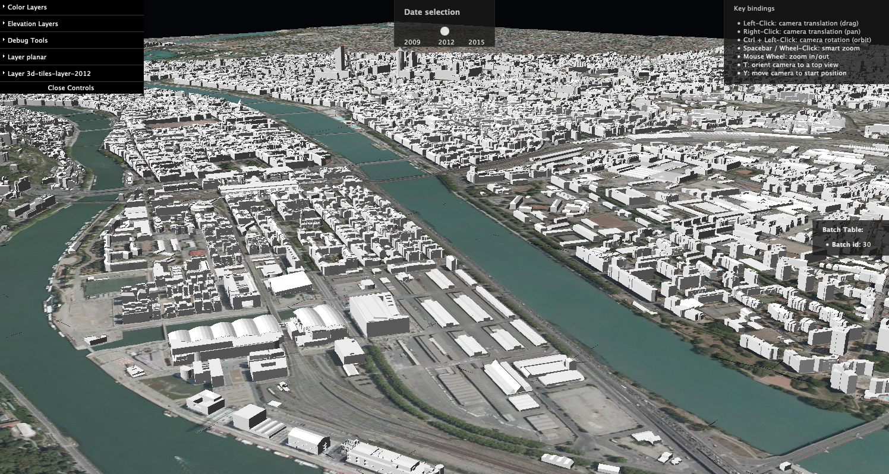

# Demo install guide : how to compute 3DTiles tileset and web visualize it



The goal of this demo is to set up [this visualization](http://rict.liris.cnrs.fr/iTownsPlanar3DTiles/itowns/examples/planar_3dtiles.html) i.e. to be able to navigate in 3D among the buildings of a City (at the city scale)

Proceed with the following install guides
 * Compute 
   [a 3DTiles tile set](https://github.com/VCityTeam/UD-Reproducibility/blob/master/Computations/3DTiles/LyonTemporal/PythonCallingDocker/Readme.md#running-the-static-tiler-workflow) suiting your needs.
    Let us assume that the generated 3DTiles are located in the `<path-to-py3dtiles>/junk/`
    sub-directory (this sub-directory should exist hold a file named `tileset.json` as well
    as another sub-directory named `tiles` and containing files with `.b3dm` extensions.
 
 * Install a 3DTiles web server: depending on your context use
   - [3dtiles web server: DESKTOP developing context](https://github.com/VCityTeam/UD-Reproducibility/blob/master/ExternalComponents/3DTilesSamples/Install3dTilesNodeBasedWebServer.md)
   - [3dtiles web server: OPERATIONS (stable server) context](https://github.com/VCityTeam/UD-Reproducibility/blob/master/ExternalComponents/ApacheServer/InstallDebianApacheServer.md)
 
 * Place the 3dTiles tileset you wish to visualize within the `tilesets` sub-directory
   that is exposed by the `3DTilesSamples` server. Alternatively use a symbolic link to
   point to it (`cd tilesets && ln -s <path-to-py3dtiles>/junk/ .` ).
   Assert that the `junk` tileset is properly served by browsing the
   `http://localhost:8003/tilesets/junk/tileset.json`.

 * [Intall UD-Viz web client](Readme.md#frontend-udv-web-client-install-notes).
   Let us assume that `<path-to-UDV>` designates the directory holding the
   UD-Viz installation.
 
 * Configue UD-Viz to access your 3dTilesSamples web server. For this
   edit the `<path-to-UDV>/UDV-Core/examples/data/config/generalDemoConfig.json`
   configuration file and define/overload the 
   [`3DTilesLayer:building:url'](https://github.com/VCityTeam/UD-Viz/blob/master/UD-Viz-Core/examples/data/config/generalDemoConfig.json#L137)
   entry to be `"http://localhost:8003/tilesets/junk/tileset.json"`
     
 * [Run the UD-Viz web client](Readme.md#frontend-udv-web-client-install-notes)
   ```
    cd <path-to-UDV>/UDV-Core/
    npm start
    ```
    Your shell should display a message similar to 
    `Project is running at the address <http://localhost:port-number>`.
    Use a web browser to open that page and select the `UDV Full Modules Demo`
    entry. The displayed tileset should be the generated one.
   
**[CAVEAT EMPTOR](https://en.wikipedia.org/wiki/Caveat_emptor)**: 
depending on the geographical area you want to visualize, you may
need to 
[adapt the **extent**](https://github.com/MEPP-team/VCity/wiki/Adapt_extent)
of the representation.
 
 Note: for the (historical) record computing the tilesets used (circa 2018) to require to
  - [Install a 3DCityDB database and populate it with data](Install3DCityDB.md) (follow the full install doc)
  - [Install the CityTiler component](https://github.com/MEPP-team/py3dtiles/blob/Tiler/Tilers/CityTiler/Install.md) and [generate the 3dTiles tileset](https://github.com/MEPP-team/py3dtiles/blob/Tiler/Tilers/CityTiler/Install.md#5a-running-the-citytiler): do follow stage 5a but OMIT stage 5b
