## Working with [Lyon Métropole's](https://data.beta.grandlyon.com/en/accueil) CityGML data

## Single vintage difficulties

### Data with some format error
The following glitches might block your algorithms at parsing time
(which is fine) but might also confuse any geometrical post-treatment
(which might be harder to detect) :
 * A few `<gml:MultiSurface srsDimension="3">` entries, used to decribe the geometry
   of the respective parts of a building, are empty. This is the case for 
    - building `<bldg:Building gml:id="LYON_8_00166">` (starting on line 1202763 and ending at line 1202789) and
      building `<bldg:Building gml:id="LYON_8_00177">` (that prior to the above previous block deletion, is
      starting on line 1202791 and ending at line 1202817) within the file `LYON_8EME_2009/LYON_8EME_BATI_2009.gml` of
      [LYON_1ER_2009.zip](https://download.data.grandlyon.com/files/grandlyon/localisation/bati3d/LYON_1ER_2009.zip)
    - 2012 intall: autre type
 * Consider the `LIMONEST_BATI_2009.gml` as extracted from the [LIMONEST_2009.zip file](https://download.data.grandlyon.com/files/grandlyon/localisation/bati3d/LIMONEST_2009.zip). `LIMONEST_BATI_2009.gml` is not a valid XML file: it ends at line `881 588` leaving a stack of unclosed tags (including the main `</cityModel>` tag). It looks like the production tool used for that file called it quits right in the middle of the `<gml:LinearRing gml:id="UUID_0a6405ad-babe-4d4c-9033-d91ea9132237">` tag...
 * Consider the dataset from [LIMONEST_2012.zip file](https://download.data.grandlyon.com/files/grandlyon/localisation/bati3d/LIMONEST_2012.zip). This dataset misses one district 
 
 * Also note that when importing similar CityGML data with the [3DCityDB importer](https://github.com/3dcitydb/importer-exporter) into a database, the importer complains with quite a few `Linear ring not closed` warning messages.

### Heterogeneous CityGML version encoding (and ill-specified schema?)
Consider [LYON_5EME_2009.zip](https://download.data.grandlyon.com/files/grandlyon/localisation/bati3d/LYON_5EME_2009.zip). Most of the encountered files have a default namespace corresponding to CityGML **version 1.0** (that is the root element starts with `<CityModel xmlns="http://www.opengis.net/citygml/1.0" ...`). Yet some of the files of that same 5th borough for the same 2009 vintage have a default namespace corresponding to CityGML **version 2.0** (that is the roor element starts with `<CityModel xmlns="http://www.opengis.net/citygml/2.0" ...`). Although each file is strictly correct, the set of files encodings is heterogeneous which might confuse your treatments (parsers).

Additionnaly note that the indicated namespace URI for version 2 i.e. [http://www.opengis.net/citygml/2.0](http://www.opengis.net/citygml/2.0) is a dangling URI. There indeed exists [http://schemas.opengis.net/citygml/2.0/cityGMLBase.xsd](http://schemas.opengis.net/citygml/2.0/cityGMLBase.xsd) but no redirection from [http://www.opengis.net/citygml/2.0](http://www.opengis.net/citygml/2.0) to it (this redirection seems to be [done only for the version 1](http://www.opengis.net/citygml/1.0)).

### Undocummented additional data (?)
Some information, provided in the form a generic attribute (`<gen:stringAttribute ... >`, `<gen:intAttribute ...>`,
`<gen:doubleAttribute ...>`) i.e. extending the CityGML model, is not always documented. For example the `MultipleEnveloppeExample_1-LYON_1ER_BATI_2015.gml` CityGML file (extracted from [LYON_1ER_2015.zip](https://download.data.grandlyon.com/files/grandlyon/localisation/bati3d/LYON_1ER_2015.zip)) presents the 
following tags:

"BUILDINGID", "MILLESIME", "ZMIN", "ADRESSE", "NOMCOMMUNE", "NOMOFFICIE", "CODE_INSEE","CODE_DGI",
"SURFTOIT, "ADMINISTRA", "CULTE", "DEPLACEMEN", "ENSEIGNEME", "SANTE", "SPORT","URGENCE", "NBMAIS", "NIVMAIS",
"MAISDATMIN", "NBAPP", "NIVAPP", "APPDATMIN", "APPDATMAX", "NBCOMIN", "NIVCOMIN", "COMIDATMIN", "COMIDATMAX",
"NBDEP", "NIVDEP", "DEPDATMIN", "DEPDATMAX", "ZMINTOIT", "ZMAXTOIT" and "ZMOYTOIT". 

Additionnaly quite a few of those attributes have no associated value (or have a dummy one).

The drawback of such generic attributes is that is cannot be used (because we don't know the semantics) and yet
it makes the CityGML files bigger (and some of them are already too heavy to be edited).

### Some geometrical imprecision ? (1)
The geometry of the following building (refer to [this CityGML file](MultipleEnveloppeExample_2_pathologic/MultipleEnveloppeExample_2_pathologic-LYON_1ER_BATI_2015.gml) as extracted from
[LYON_1ER_2015.zip](https://download.data.grandlyon.com/files/grandlyon/localisation/bati3d/LYON_1ER_2015.zip)) 

is hard to interpret (probably due to the complexity of the description of the rooftops ?).
Indeed if we try to observe its footprint (with QGIS) by projecting its "</bldg:RoofSurface>" on the natural
terrain then we get the following picture:

### Some geometrical imprecision ? (2)
In the 2012 data set, the following building (refer to [this CityGML file](MultipleEnveloppeExample_5_pathologic_leaning_tower/Splited_ChangeDetection_multiple_enveloppe-2_LYON_1ER_BATI_2012_Splited.gml) (extracted from [LYON_1ER_2012.zip](https://download.data.grandlyon.com/files/grandlyon/localisation/bati3d/LYON_1ER_2012.zip)) is provided in a single "block"

and has the following footprint (which is fine)

.

In the 2015 data set this "block" is splitted in two buildings (which is still fine) (refer to [this CityGML file](MultipleEnveloppeExample_5_pathologic_leaning_tower/Splited_ChangeDetection_multiple_enveloppe-2__LYON_1ER_BATI_2015.gml) as extracted from [LYON_1ER_2015.zip](https://download.data.grandlyon.com/files/grandlyon/localisation/bati3d/LYON_1ER_2015.zip)).
The geometrical difficulty seems to arise in some overlay appearing between the two respective footprints (look at the north east facade) as illustated by the following picture:

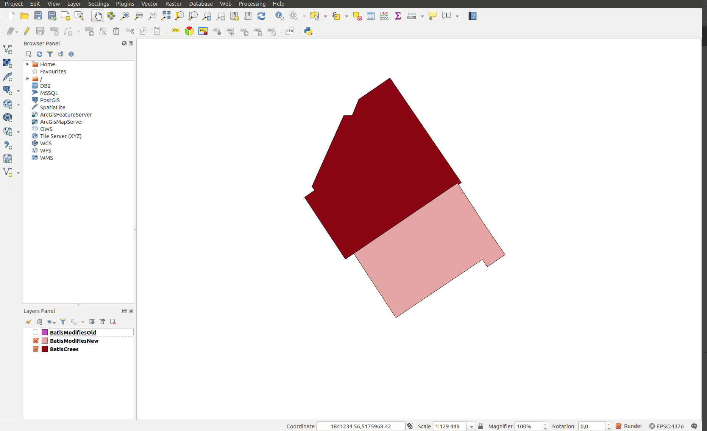

Note that such geometrical imprecission has an impact on the interpretation one makes of the building spliting. 
Should one consider that such a situation is a "numerical" approximation or did the total surface of the (two) buildings
changed across time (because there geometry of the building changed).

### Multiple enveloppe (sub-buildings): what is the semantic behind building regroupment ?
It is hard to understand what is the logic that governs the regroupement of the geometries
of independent physical buildings (that is buildings that are geometrically distinct i.e.
separated by a spatial gap) within a single CityGML "logical" building. Note that this is made
possible by the CityGML model that offers to provide e.g. as many `</bldg:WallSurface>` and/or
`</bldg:RoofSurface>` (possibly defined as `<gml:MultiSurface>`) are desired.
For example the following CityGML building (with a single gml identifier) is constituted
of many different sub-buildings (refer to the `MultipleEnveloppeExample_1-LYON_1ER_BATI_2015.gml` CityGML file extracted from [LYON_1ER_2015.zip](https://download.data.grandlyon.com/files/grandlyon/localisation/bati3d/LYON_1ER_2015.zip)):

Although in the above case, the regroupement of sub-buildings (that all belong to the so
called ["subsistances"](https://en.wikipedia.org/wiki/Les_Subsistances) probably follows to administrative logic,
what about the following case where a single CityGML logical buildings gathers close to 50 independent buildings
(highlighted in red):

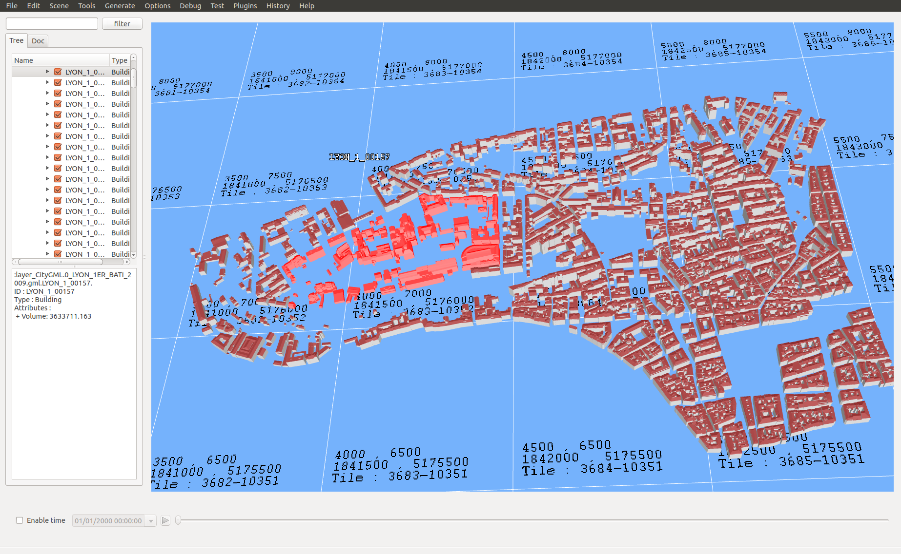

**Possible improvement of the data**: **choose a single regroupement logic** (while providing the associated semantics) and **apply that logic homogeneously across the city data**.

### Trying to degroup buildings: the limit of the split building strategy (1)
In order to separate the "artificial" building regroupment one can try to split them. The following cases illustrate
the current geometrical numerical limits of this strategy.

The following picture illustates that the spliting algorithms cannot deal adequatly with some of technical rooms located at 
the top of the lift of the building (that get detected as separated buildings):

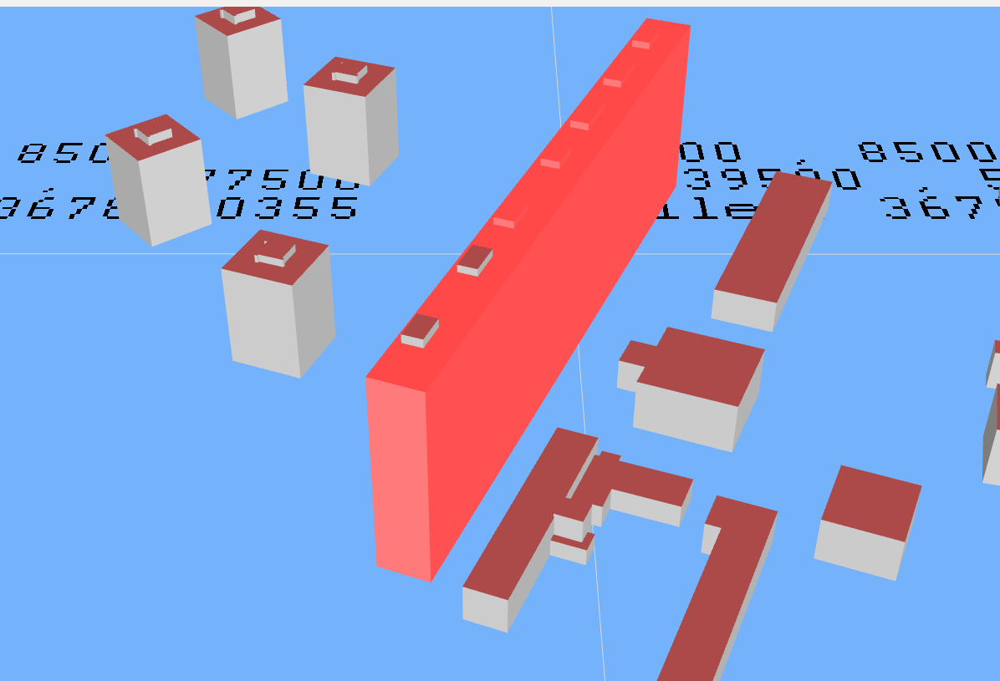

### Trying to degroup buildings: the limit of the split building strategy (2)
The following picture illustates the result of applying the split algorithm on a 2012 building 
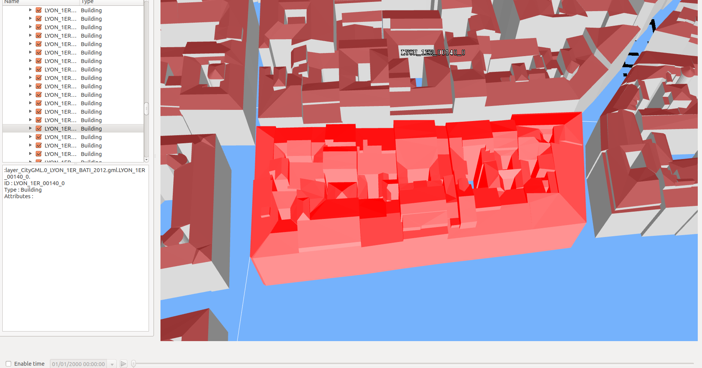
The same building comes splitted within the 2015 data. Let us consider the building (defined by [this CityGLM file](MultipleEnveloppeExample_3_split_problem/LYON_1ER_BATI_2015_extracted_problem_multiple_envelopes_2_69381AT59.gml) extracted from [LYON_1ER_2015.zip](https://download.data.grandlyon.com/files/grandlyon/localisation/bati3d/LYON_1ER_2015.zip)) illustrated by the following picture

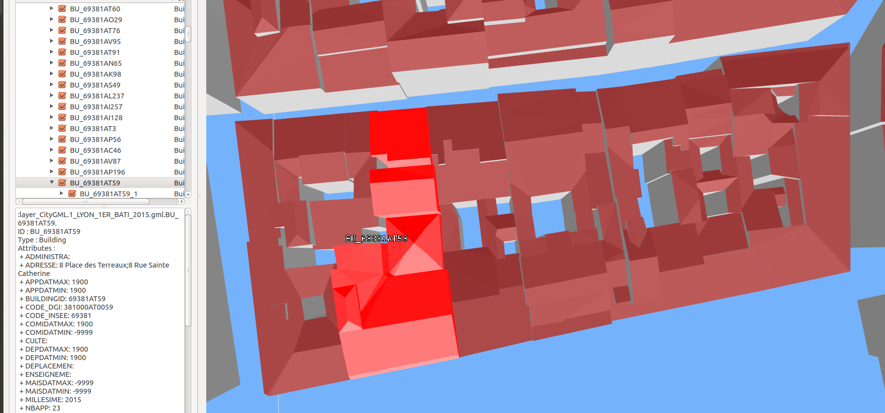

Alas this logical building should/might be described as two buildings. Indeed although seen from far this building seems
unique 
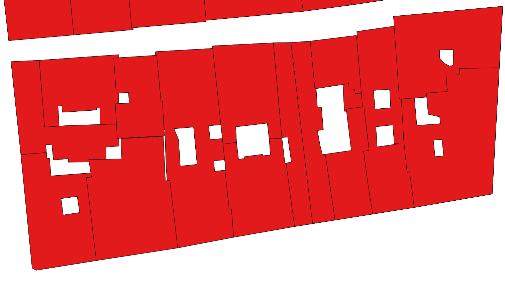
the following close up reveals that they are separated
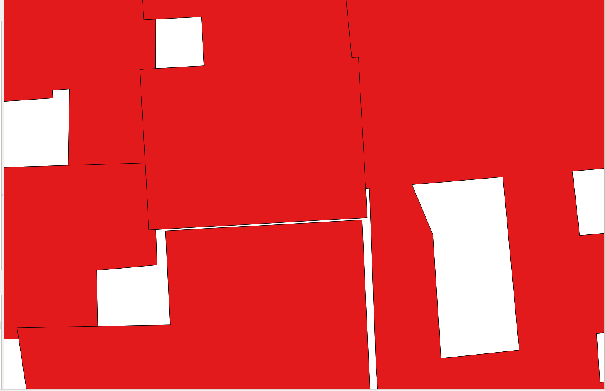

Note: we failed to apply the split algorithm on 2015 files because of a change in the format (from 2012).

**Possible improvement of the data**: as illustrated below (refer to the inter-vintages comparison difficulties) probably that the best practice would be to provide CityGML data where a single CityGML building correponds to a single geometrical building.

## Inter vintage hindrances
A difficulty, in understanding the dynamic evolution of the geometry
of city, can arise when the identifier (labeling) of a singular city
object changes across vintages.

### Changes in the building (city object) identifiers (labeling)
For example consider the changes in the labeling of the same physical
buildings (more generaly any city object) between year 2012 and 2015:

**Possible improvement of the data**: understanding the city changes would be greatly simplified
if the **identifiers remained valid accross vintages**.
 
### Changes in the data semantic structuration 
As illustrated in the above "Single vintage difficulties", buildings come logically regrouped
(with some undocummented strategy). An additional difficulty comes from the fact that this
regrouping strategy changes accross vintages: for the 2015 vintage data buildings seem to
be decomposed against land registry. In opposition the previous 2009 and 2012 vintages seem
to adopt a different strategy.
**Possible improvement of the data**: avoid structural changes in the description of the data.

### Changes in data formats
Accross years the CityGML changed and different vintages use different file formats.
A single algorithm trying to establish comparisons across vintages require to know
about all searche formats.

**Possible improvement of the data**: rewrite previous vintages with the "current"
CityGML file format (?). 

### Changes in the file spliting
The so called remarkable buildings (or landmark builds) are not the same
across the 2019, 2012 and 2015 vintages. Hence the buildings encountered
in the respective `BATI` and `BATI_REMARQUABLE` files do change across the
vintages. A drawback is here that one cannot make a `BATI` to `BATI` (or
`BATI_REMARQUABLE` to `BATI_REMARQUABLE`) comparison across vintages.

**Possible improvement of the data**: when a file separation criteria is 
needed (be it burough or special types of buildings), then provide such
criteria and keep them across vintages.

### Numerical imprecisions across vintages
As observed above, the building regroupement can change across vintages. The following two pictures
illustrate the situation for 2009 and 2012 vintages:
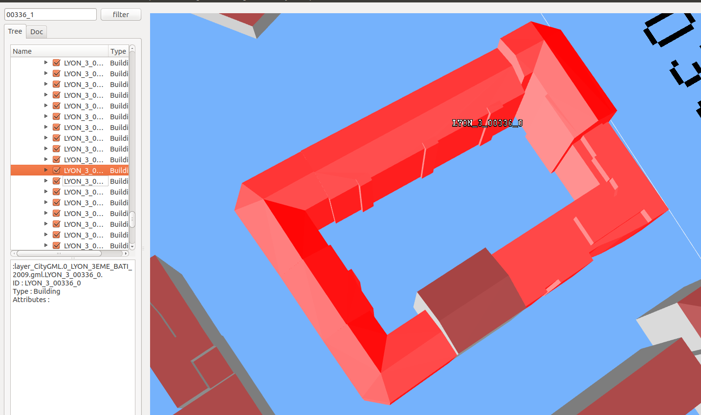
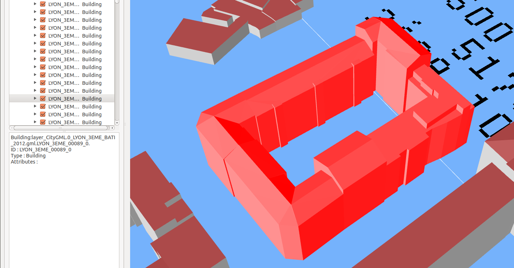

But if we compare the respective footprints (projection on the natural terrain) we can observe
a slight difference:
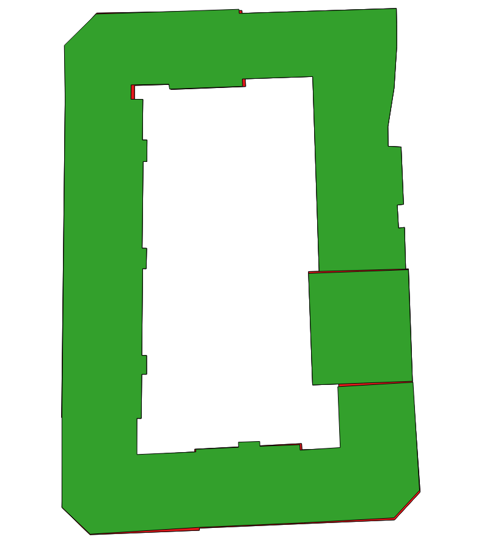

### Switch of regroupment strategy
Consider the following building of the 2012 vintage:
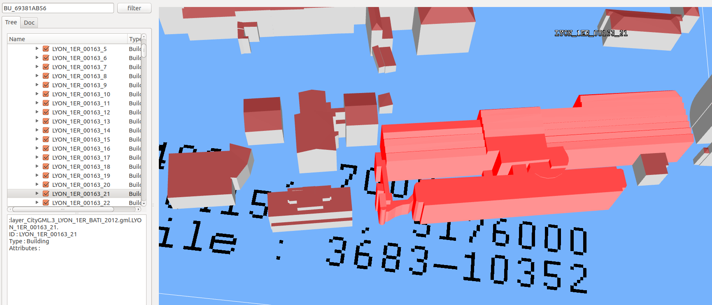

The central part of the this building becomes the following building (notice that a piece located at the extreme west of the building is missing): 
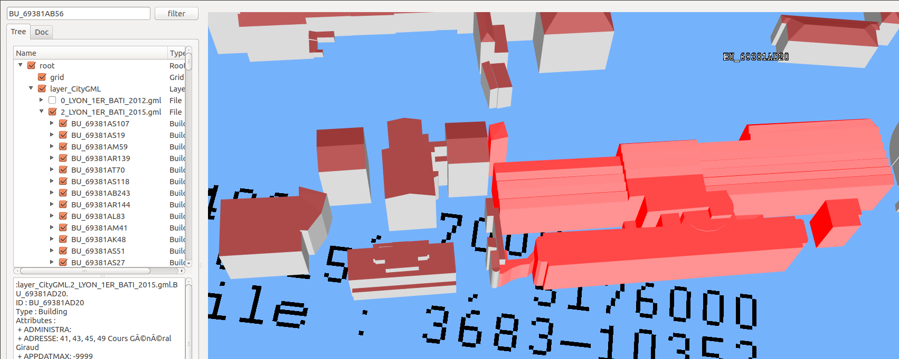

The "missing" sub-building gets regrouped with another building as illustrated here (2015 vintage):
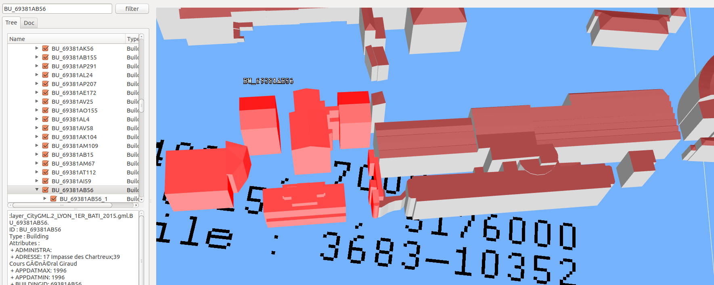

Such a reaffectation of sub-building makes it complicated to interpret the city changes.

**Possible improvement of the data** (already mentionned above): provide CityGML data where each CityGML building correponds to a single geometrical building.

## Open questions
 * Would there be some technical means to provide some evaluation of the
   induced acquisition error (for a given data) ?

